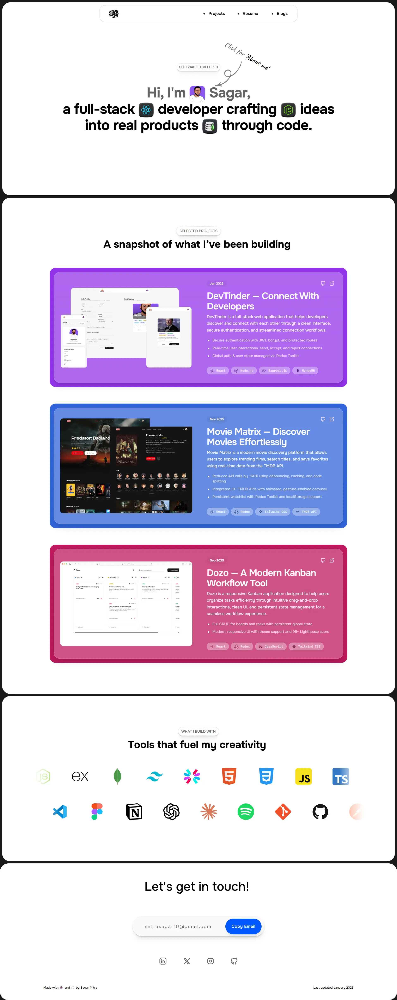
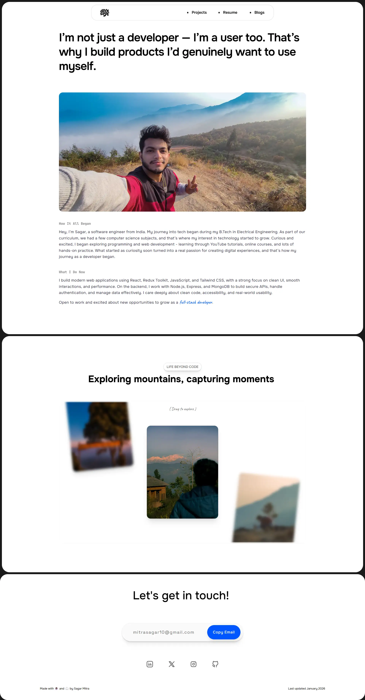

<h1 align="center">Portfolio v2.0</h1>

A modern, responsive personal portfolio showcasing my projects, skills, and creativity as a Frontend / Full Stack Developer.  
Built with a strong focus on clean UI, smooth interactions, and performance.

  <a  href="https://sagar-portfolio-dxs.vercel.app/"><strong>View Demo »</strong></a>

---

## 📸 Screenshots

<table align="center">
  <tr>
    <td>
      

 Home Page 

    </td>
    <td>
    

 About Me Page 

    </td>
  </tr>
</table>

---

## ✨ Features

- ⚡ Modern, responsive UI
- 🎬 Smooth animations & micro-interactions
- 🧩 Reusable and scalable component architecture
- 🌙 Clean, minimal design focused on readability
- 📱 Optimized for all screen sizes
- 🚀 Fast load times and optimized assets

---

## 🛠 Tech Stack

### Frontend

- **React.js**
- **JavaScript (ES6+)**
- **Tailwind CSS**
- **Framer Motion**
- **HTML5 & CSS3**

### Tools & Platforms

- **Vercel** (deployment)
- **Git & GitHub**
- **Figma** (UI reference & design)
- **VS Code**

## 📄 License

This project is licensed under the MIT License.  
If you reuse or modify this project, **proper attribution is required**.

See the [LICENSE](./LICENSE) file for full details.

---

## 📬 Contact

#### Sagar Mitra - Frontend / Full Stack Developer

- Email: [mitrasagar10@gmail.com](mailto:VYt4f@example.com)
- Linkedin: [@sagar-mitra19](https://www.linkedin.com/in/sagar-mitra19/)
- X (Twitter): [@devxsagar](https://x.com/devxsagar)

---

<h3 align="center"> ⭐ If you found this project useful, feel free to star the repository. </h3>
